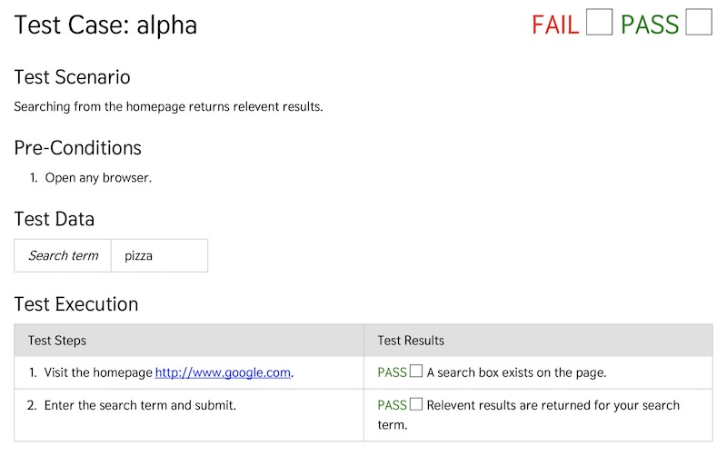

# Manual Test

## Summary

Lorem ipsum dolor sit amet, consectetur adipiscing elit. Praesent ac blandit risus. Mauris tempor a lacus a placerat. Vivamus viverra dapibus metus non finibus. Nulla ultricies est nulla, eget efficitur nibh viverra non. Sed sed est viverra nunc malesuada venenatis vitae at tellus. Suspendisse potenti. Morbi non blandit elit, sit amet consectetur mi.

**Visit <https://aklump.github.io/manual_test> for full documentation.**

## Quick Start

1. `composer require aklump/manual-test`
1. `cp ./examples/config.xml ./config.xml`
1. Modify _config.xml_ as necessary
1. Relative paths are relative to the config file.
1. `./vendor/bin/generate --configuration=manualtest.xml`

## Requirements

* alpha
* bravo

## Contributing

If you find this project useful... please consider [making a donation](https://www.paypal.com/cgi-bin/webscr?cmd=_s-xclick&hosted_button_id=4E5KZHDQCEUV8&item_name=Gratitude%20for%20aklump%2Fmanual_test).

## Installation

1. lorem
1. ipsum

## Usage
