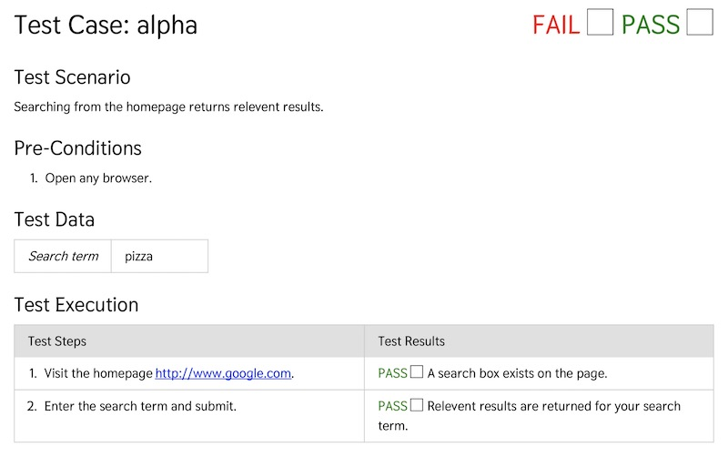

# Manual Test



## Summary

Manual test is a way to create QA testing for human running.  It's for those situations where automated testing is forthcoming, would not be feasible.  It's meant to be a very quick and simple way to have QA.

**Visit <https://aklump.github.io/manual_test> for full documentation.**

## Quick Start

This one-liner will create a folder called tests_manual and install this library there using composer.

```bash
([ ! -d tests_manual ] || (echo "\nFailed, directory \"tests_manual\" already exists\n" && exit 1)) && mkdir -p ./tests_manual/example_tests && (cd tests_manual && echo "{}" > composer.json && composer require --dev aklump/manual-test && cp -R ./vendor/aklump/manual-test/examples/ ./example_tests/ && mv ./example_tests/config.xml ./ && echo "\nInstalled.  Please look in ./tests_manual to get started...\n")
```

1. Modify _tests_manual/config.xml_ as necessary
1. Create at least one folder, with a manual test.  You may delete or refer to _tests_manual/example_test_ for this step.
1. Relative paths are relative to the config file.
1. `export TEST_BASE_URL=http://mysite.com; ./vendor/bin/generate --configuration=config.xml`
1. You can also do like this: `export SIMPLETEST_BASE_URL=http://mysite.com; ./vendor/bin/generate --configuration=config.xml`

## Contributing

If you find this project useful... please consider [making a donation](https://www.paypal.com/cgi-bin/webscr?cmd=_s-xclick&hosted_button_id=4E5KZHDQCEUV8&item_name=Gratitude%20for%20aklump%2Fmanual_test).
